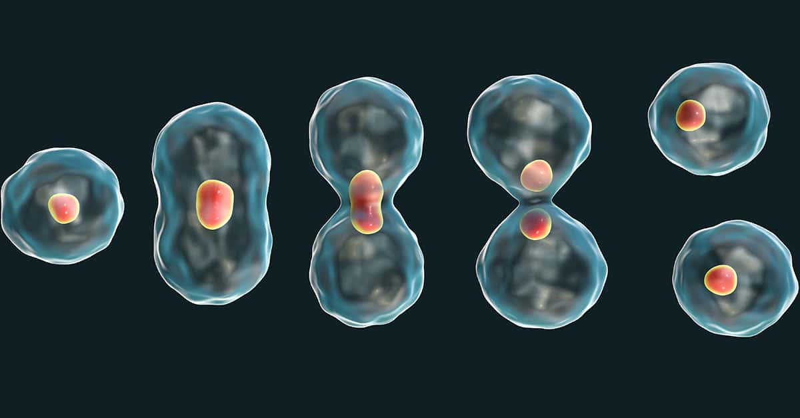

# Go 语言的深拷贝与浅拷贝

- 深拷贝通常比浅拷贝耗时更多；
- 日常开发工作，深拷贝的使用频率相对较低，可能有 80% 的时间不需要使用深拷贝。

## 概念



### 浅拷贝

创建一个新对象，并复制原对象的字段值，但对于引用类型(如指针、切片、map等)，仅复制引用，不复制引用所包含的对象。

通过简单的赋值操作就能实现浅拷贝。

### 深拷贝

创建一个新对象，**递归**地复制原对象的所有字段值，对于引用类型，创建新的对象并复制其内容，而不是简单地复制引用。

通常，深拷贝需要额外编写代码实现，简单的赋值操作对于复杂类型而言，无法实现深拷贝。

## 深拷贝的适用场景

### 防止意外修改共享数据

不可变对象需求，例如函数式编程和安全性要求较高的场景。

```go
package deep_copy

import (
	"fmt"
	"testing"
)

type Config struct {
	Port int
	Data map[string]string
}

func TestDeepCopy(t *testing.T) {
	original := &Config{
		Port: 8080,
		Data: map[string]string{"key": "value"},
	}

	shallowCopy := original // shallowCopy 是浅拷贝的产物，共享 original 的 Data 引用

	// 深拷贝
	deepCopy := &Config{
		Port: original.Port,
		Data: map[string]string{},
	}
	for k, v := range original.Data {
		deepCopy.Data[k] = v
	}

	// 修改原始对象
	original.Port = 8081
	original.Data["key"] = "newValue"

	deepCopy.Port = 8082
	deepCopy.Data["key"] = "deepCopyValue"

	// 验证浅拷贝和深拷贝的结果
	fmt.Println("original:", original)       // &{8081 map[key:newValue]}
	fmt.Println("shallowCopy:", shallowCopy) // &{8081 map[key:newValue]}，shallowCopy 的修改影响 original
	fmt.Println("deepCopy:", deepCopy)       // &{8082 map[key:deepCopyValue]}，deepCopy 的修改不影响 original
}
```

### 并发编程中的数据隔离

如果每个 goroutine 都需要独立的数据副本，那么深拷贝是确保数据隔离的最佳方法。
```go
func worker(data []int, ch chan []int) {
	// 深拷贝切片，避免影响其他 goroutine
	newData := append([]int(nil), data...)
	for i := range newData {
		newData[i] *= 2 // 修改数据
	}
	// 写入数据
	ch <- newData
}

func TestDeepCopy2(t *testing.T) {
	data := []int{1, 2, 3}
	ch := make(chan []int)

	go worker(data, ch)
	go worker(data, ch)

	// 读取数据
	result1 := <-ch
	result2 := <-ch

	fmt.Println("data:", data)       // [1, 2, 3]
	fmt.Println("result1:", result1) // [2, 4, 6]
	fmt.Println("result2:", result2) // [2, 4, 6]
}
```

### 回滚机制或撤销操作

在涉及事务处理或修改数据等场景，用户操作出现错误，需要恢复到原始状态。

```go
func TestDeepCopy3(t *testing.T) {
	// 初始化原始状态
	state := &State{
		Value: "initial",
		Data:  []int{1, 2, 3},
		Metadata: &Metadata{
			Version: 1,
			Author:  "Alice",
		},
	}

	// 保存当前状态的深拷贝
	backup := deepCopy(state)

	// 修改状态
	state.Value = "modified"
	state.Data[0] = 100
	state.Metadata.Version = 2

	// 输出修改后的状态
	fmt.Println("Current state:", state.Value)                       // 输出 "modified"
	fmt.Println("Current Data:", state.Data)                         // 输出 "[100 2 3]"
	fmt.Println("Current Metadata.Version:", state.Metadata.Version) // 输出 "2"

	// 恢复之前的状态
	state = backup

	// 输出恢复后的状态
	fmt.Println("Restored state:", state.Value)                       // 输出 "initial"
	fmt.Println("Restored Data:", state.Data)                         // 输出 "[1 2 3]"
	fmt.Println("Restored Metadata.Version:", state.Metadata.Version) // 输出 "1"
}

// 深拷贝函数，通过 JSON序列化与反序列化实现
func deepCopy(original *State) *State {
	copy := &State{}
	bytes, _ := json.Marshal(original)
	_ = json.Unmarshal(bytes, copy)
	return copy
}
```

### 小结
深拷贝虽然开销较大，但它确保了数据的独立性、隔离性以及安全性。深拷贝适用场景无法全部穷举，只能列举部分。

## Go 语言中实现深拷贝的方法

### 自己手搓

像上面示例中那样，根据具体的类型手动实现深拷贝。

#### 优点
- 避免反射，性能较好；
- 开发者可以完全控制拷贝的过程。


#### 缺点
- 需要为每种类型都单独实现深拷贝；
- 对带有复杂嵌套的类型，实现会冗长和复杂。

### 反射

通过 Go 的 reflect，实现通用的深拷贝。

#### 优点
- 通用性强。

#### 缺点
- 性能降低，有额外开销；
- 被拷贝类型中带有非导出字段，会抛出 panic。

```go
type Address struct {
	Street string
	City   string
}

type Person struct {
	Name    string
	Age     int
	Address *Address
}

func TestDeepCopy4(t *testing.T) {
	// 初始化原始对象
	original := &Person{
		Name: "Alice",
		Age:  30,
		Address: &Address{
			Street: "123",
			City:   "Golang City",
		},
	}

	// 使用 reflect 实现的通用深拷贝
	copy := DeepCopy(original).(*Person)

	// 修改拷贝对象的值
	copy.Address.City = "New City"

	// 输出结果
	fmt.Println("Original Addr:", original.Address) // 输出 &{123 Golang City}
	fmt.Println("Copy Addr:", copy.Address)         // 输出 &{123 New City}
}

// 深拷贝函数，使用 reflect 递归处理各种类型
func DeepCopy(src interface{}) interface{} {
	if src == nil {
		return nil
	}

	// 运行时，通过 reflect 获取值和类型
	value := reflect.ValueOf(src)
	typ := reflect.TypeOf(src)

	switch value.Kind() {
	case reflect.Ptr:
		// 对于指针，递归处理指针指向的值
		copyValue := reflect.New(value.Elem().Type())
		copyValue.Elem().Set(reflect.ValueOf(DeepCopy(value.Elem().Interface())))
		return copyValue.Interface()

	case reflect.Struct:
		// 对于结构体，递归处理每个字段
		copyValue := reflect.New(typ).Elem()
		for i := 0; i < value.NumField(); i++ {
			fieldValue := DeepCopy(value.Field(i).Interface())
			copyValue.Field(i).Set(reflect.ValueOf(fieldValue))
		}
		return copyValue.Interface()

	case reflect.Slice:
		// 对于切片，递归处理每个元素
		copyValue := reflect.MakeSlice(typ, value.Len(), value.Cap())
		for i := 0; i < value.Len(); i++ {
			copyValue.Index(i).Set(reflect.ValueOf(DeepCopy(value.Index(i).Interface())))
		}
		return copyValue.Interface()

	case reflect.Map:
		// 对于映射，递归处理每个键值对
		copyValue := reflect.MakeMap(typ)
		for _, key := range value.MapKeys() {
			copyValue.SetMapIndex(key, reflect.ValueOf(DeepCopy(value.MapIndex(key).Interface())))
		}
		return copyValue.Interface()

	default:
		// 其他类型（基本类型，数组等）直接返回原始值
		return src
	}
}

```

### 第三方库

- github.com/jinzhu/copier

## Go 语言中深拷贝的局限性

### 无法访问非导出字段

如果原类型中带有非导出字段，那么有些时候即便使用 jinzhu/copier 这样的第三方通用拷贝库也很难实现真正的深拷贝。

如果原类型在你的控制下，最好的方法是为原类型手动添加一个 DeepCopy 方法供外部使用。（回归手搓）

### 循环引用问题

原类型中存在循环引用时，简单的递归深拷贝可能会导致无限循环。

针对这样的带有循环引用的类型，通常会手搓 DeepCopy 方法，通过使用类似哈希表的方式，记录已经复制过的对象。

### 某些类型不支持拷贝

某些内置类型或标准库中的类型，比如 sync.Mutex、time.Timer 等，复制这些类型可能会导致未知行为。

对于这样的包含不支持拷贝的类型，在不改变源类型组成的情况下，无法实现深拷贝。

## 小结
除了上面三种情况外，有些时候性能也是使用深拷贝时需要考量的点，尤其是使用反射的时候，可以考虑手搓代替反射、使用对象池和预分配的方式，优化内存分配，减少深拷贝次数。

## 深拷贝与克隆
它们都是复制对象的概念，但它们在概念和实现细节上，存在一些差异。

克隆是指复制一个对象。其行为依赖于具体语言的实现方式。对于某些语言，克隆可能指的是浅拷贝（Shallow Copy），即只复制对象的基础数据字段，引用类型字段仍然指向原始对象。也有些语言将克隆定义为深拷贝，取决于上下文。比如在 Java 中，Object 类提供了 clone() 方法，默认是浅拷贝，用户可以通过实现 Cloneable 接口来自定义克隆的行为，比如实现为深拷贝的逻辑。

而深拷贝是一种递归的复制过程，不仅复制对象本身，还会复制该对象所有引用的其他对象。

目标对象在结构上与原对象一致的情况下，**可以将深拷贝理解为一种特定类型的克隆。**


## 参考
- 《Go语言中的深拷贝：概念、实现与局限》，作者：TonyBai，链接：https://tonybai.com/?s=%E6%B7%B1%E6%8B%B7%E8%B4%9D